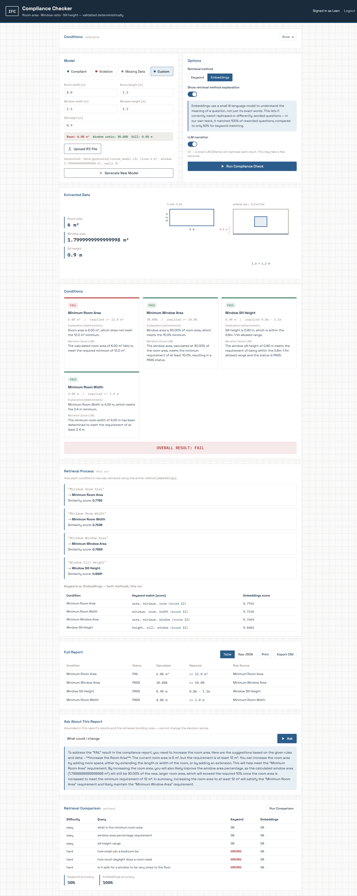
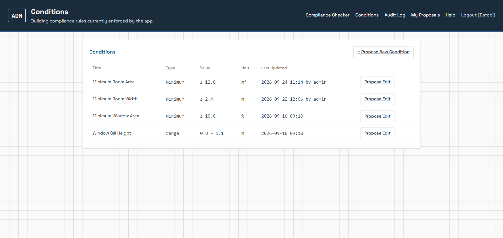
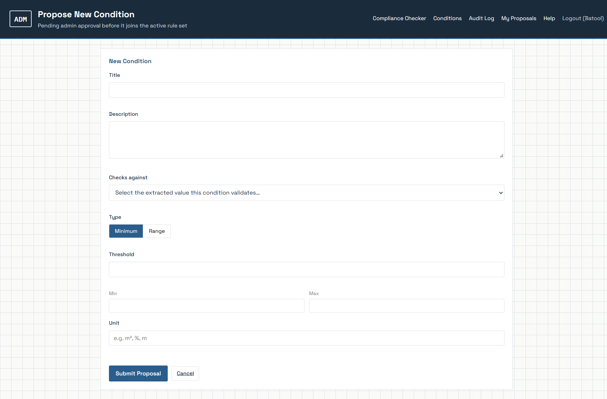
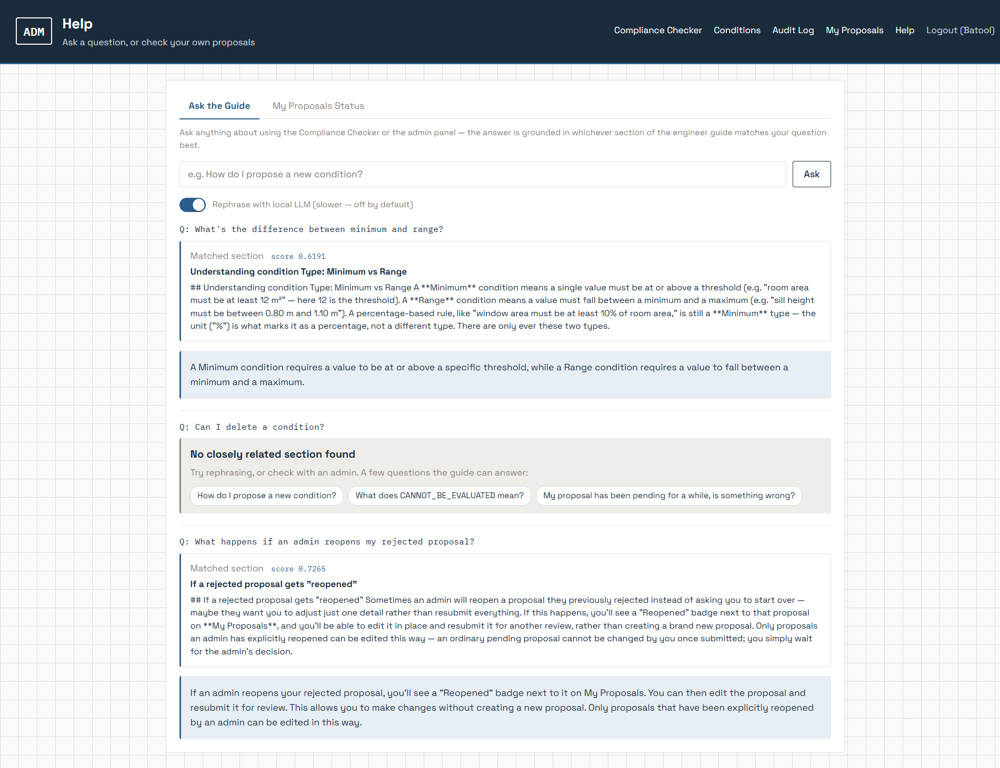
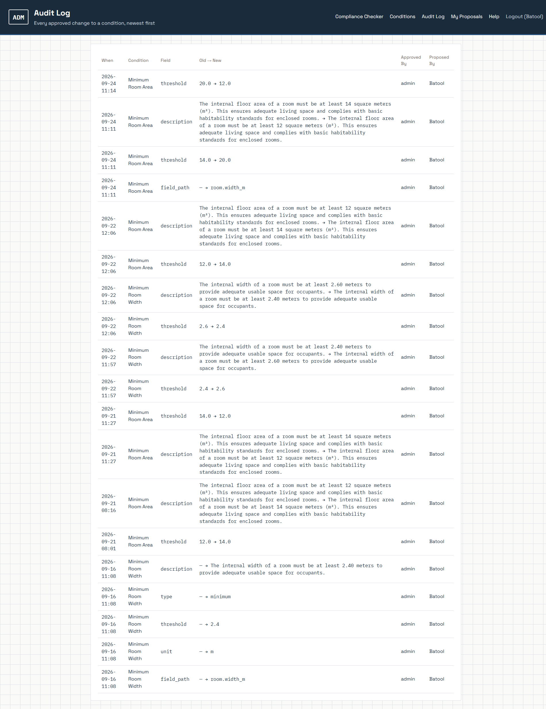
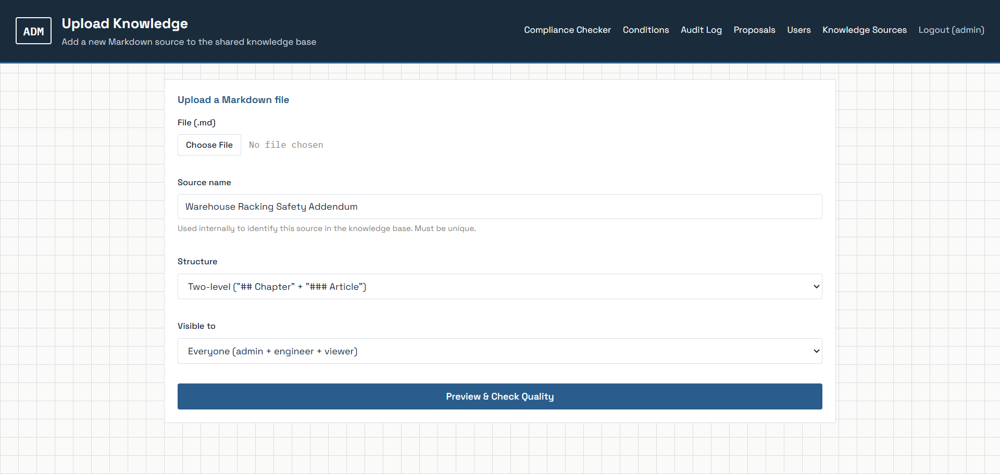
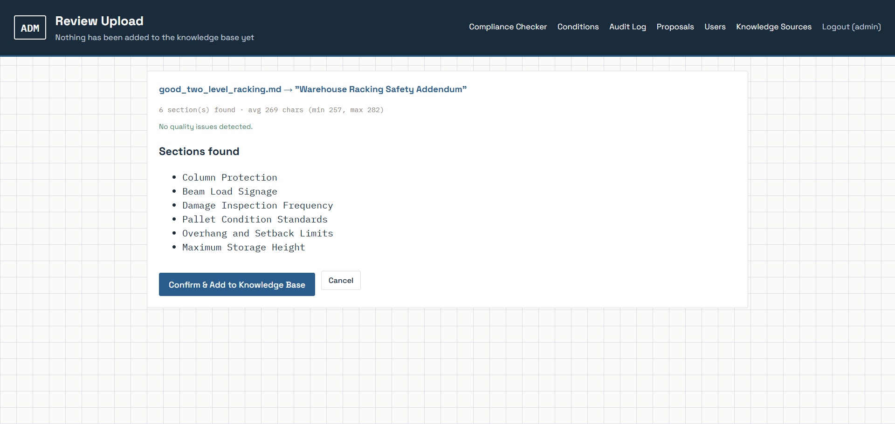
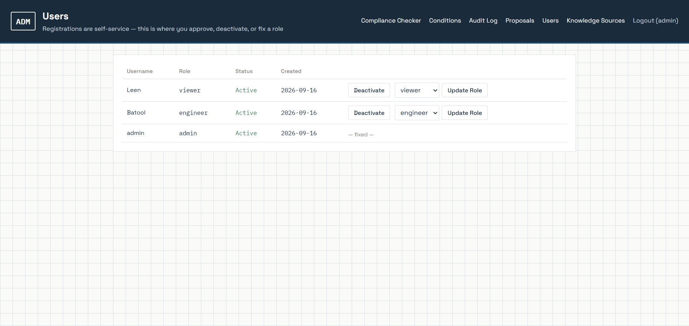
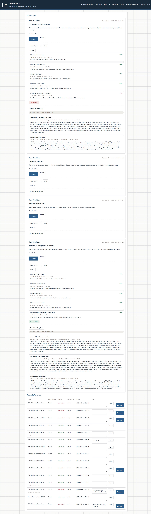

# AI-Assisted IFC Compliance Checker


An AI-assisted application that checks a BIM/IFC building model against
written building compliance rules, combining **Python**, **IfcOpenShell**,
**Retrieval-Augmented Generation (RAG)**, and **deterministic validation**.

The system reads an IFC model, extracts room and window data dynamically
— by IFC type and relationship, never by hardcoded IDs or names —
retrieves the relevant building condition using RAG, validates the
extracted data with pure Python arithmetic, and produces a compliance
report: **PASS**, **FAIL**, or **CANNOT_BE_EVALUATED** for each condition.

This document is written to be a complete, standalone account of the
project: not just what was built, but what was deliberately *not* built,
what broke and how it was found and fixed, and how the reasoning evolved
over time — particularly around the RAG layer, which grew from a 3-chunk
proof of concept into a five-source, access-controlled, hybrid-retrieval
system over the course of this project.

> Built with the help of AI assistants as reviewers and thinking
> partners throughout development — every design decision, every test,
> and every line shipped was verified by hand on a real running
> instance; several AI-suggested claims were caught, rejected, or
> corrected along the way (see the RAG journey below for examples).

---

## At a glance

- **What it does:** checks a 3D building model (`.ifc`) against written
  building-code rules and reports **PASS / FAIL / CANNOT_BE_EVALUATED**
  per rule — with the *reason*, and a citation of the rule text it applied.
- **The design rule:** AI never decides compliance. Every PASS/FAIL comes
  from deterministic Python arithmetic. AI is limited to retrieving rule
  text and rephrasing explanations, and an automated test proves it cannot
  override a decision, even under a prompt-injection attempt.
- **A live rule workflow:** engineers propose new or changed rules, admins
  approve or reject them, and approved rules are checked against real
  models immediately — with a full audit trail.
- **A real RAG system, built in stages:** from a 3-chunk in-memory
  prototype to a persistent, access-controlled, five-source vector
  database with hybrid (BM25 + embeddings) retrieval and a tool-use
  feature — with each decision, and each mistake caught along the way,
  documented below.
- **Quality evidence:** 15 automated tests, unmodified and passing after
  every change; every new feature verified end-to-end through the real UI;
  real bugs found and fixed are listed with how each was found.
- **Runs fully locally:** no cloud services, no API keys, works offline
  after setup.

**Reading guide.** *2 minutes:* this section, then Phase 3 and the bugs
table. *10 minutes:* the whole RAG journey. *Everything:* read top to bottom.

---

## Why this problem is hard (short background)

**IFC** is the open file format used to exchange BIM (Building Information
Model) data. An IFC file is not a drawing — it is a graph of typed objects
(rooms are `IfcSpace`, windows are `IfcWindow`) connected by relationships.
A number such as a window's *sill height* is not stored as a field: it has
to be derived by walking the relationships
(`IfcWindow` → `FillsVoids` → `IfcOpeningElement` → placement Z, relative
to the storey elevation). And real models are frequently incomplete.

That is why this project has three outcomes rather than two. When the data
needed for a rule is missing, the honest answer is **CANNOT_BE_EVALUATED**,
not a guess and not a crash.

Building codes, meanwhile, are written in natural language. RAG connects the
human-readable rule text to the computed numbers (so a result can cite the
exact rule it was checked against), while the decision itself stays in code.

---

## Example report

A real run against the default "Compliant" scenario model produces a
report of this shape (this is the actual output for that scenario — the
`floor_area_m2`, ratio, and sill-height figures below were captured live
during this project's own Safe Tester testing, not invented for this
document; `window.area_m2` is the arithmetic result of that same run's
reported 12.86% ratio against the 14.00 m² room):

```json
{
  "source_file": "data/generated/compliant_model.ifc",
  "retrieval_method": "keyword",
  "narrated": false,
  "room": { "floor_area_m2": 14.00 },
  "window": { "area_m2": 1.80, "sill_height_m": 0.90 },
  "conditions": [
    {
      "condition": "Minimum Room Area",
      "status": "PASS",
      "calculated_value": "14.00 m²",
      "required_value": ">= 12.0 m²",
      "explanation": "Room area is 14.00 m², which meets the 12.0 m² minimum.",
      "rule_source": "Minimum Room Area",
      "rule_text": "The internal floor area of a room must be at least 12 square meters (m²). This ensures adequate living space and complies with basic habitability standards for enclosed rooms."
    },
    {
      "condition": "Minimum Window Area",
      "status": "PASS",
      "calculated_value": "12.86%",
      "required_value": ">= 10.0%",
      "explanation": "Window area is 12.86% of room area, which meets the 10.0% minimum.",
      "rule_source": "Minimum Window Area",
      "rule_text": "The window area must be at least 10% of the room's internal floor area. This is calculated as: (Window Area / Room Area) × 100 >= 10%. Adequate window area ensures sufficient natural light and ventilation."
    },
    {
      "condition": "Window Sill Height",
      "status": "PASS",
      "calculated_value": "0.90 m",
      "required_value": "0.8m - 1.1m",
      "explanation": "Sill height is 0.90 m, which is within the 0.8m-1.1m allowed range.",
      "rule_source": "Window Sill Height",
      "rule_text": "The vertical distance between the finished floor level and the bottom of the window opening (sill height) must be between 0.80 meters and 1.10 meters. This range ensures the window is safely positioned — not too low (fall risk) and not too high (usability/visibility)."
    }
  ],
  "overall_result": "PASS"
}
```

<!-- VERIFY: run `python main.py data/generated/compliant_model.ifc --quiet`
yourself once before publishing and paste the exact console/JSON output
here in place of this hand-assembled version. -->

A model that breaks a rule yields `FAIL` for that condition; a model with
missing data yields `CANNOT_BE_EVALUATED`; the overall result is `FAIL` if
any condition fails, otherwise `CANNOT_BE_EVALUATED` if any is
indeterminate, otherwise `PASS`.

---

## Table of Contents

- [At a glance](#at-a-glance)
- [Why this problem is hard](#why-this-problem-is-hard-short-background)
- [Example report](#example-report)
- [The one rule that never bends](#the-one-rule-that-never-bends)
- [The RAG journey — how this evolved, step by step](#the-rag-journey--how-this-evolved-step-by-step)
- [Architecture (current state)](#architecture-current-state)
- [Building Conditions Checked](#building-conditions-checked)
- [Admin Panel: role-based rule management](#admin-panel-role-based-rule-management)
- [Engineering highlights — real bugs found and fixed](#engineering-highlights--real-bugs-found-and-fixed)
- [Investigations](#investigations-a-path-that-was-tried-tested-and-ruled-out)
- [Deliberately out of scope (and why)](#deliberately-out-of-scope-and-why)
- [Installation](#installation)
- [Usage](#usage)
- [Web Interface](#web-interface)
- [Screenshots by role](#screenshots-by-role)
- [Libraries & Models Used](#libraries--models-used)
- [Assumptions & Limitations](#assumptions--limitations)
- [Project structure](#project-structure)
- [About](#about)
- [License](#license)

---

## The one rule that never bends

The LLM/RAG layer is used only for retrieval, explanation, and
structuring. **All calculations and the final PASS/FAIL decision are
deterministic Python — the LLM never decides compliance.** This was true
on day one with three hardcoded checks, and it's still true now that the
system has a live rule-proposal workflow, a five-source RAG layer, and an
agentic tool-use feature. Every architectural decision documented below
exists in service of keeping that boundary intact as the system grew more
capable — never to work around it.

This is enforced and verified by an automated meta-test
(`tests/test_llm_narration_meta.py`) that proves the LLM cannot override a
decision even under a deliberate prompt-injection attempt, and is
demonstrable live via `demo_llm_cannot_override.py`.

---

## The RAG journey — how this evolved, step by step

This section exists because the RAG layer is the part of this project
that changed the most, and the reasoning behind each change is more
valuable than the end state alone.

### Phase 0 — the original, deliberately minimal RAG

The project started with exactly 3 building conditions, each getting one
retrievable chunk from `knowledge_base/building_conditions.md`. Retrieval
was in-memory: a plain NumPy matrix + cosine similarity
(`rag/vector_store.py`), alongside a separate keyword-based method
(`rag/retriever.py`) kept side by side for comparison, not as a fallback.

**Why NumPy instead of a real vector database at this stage:** at 3
chunks, a dedicated vector database is genuine overhead — a plain matrix
performs identically at that scale, with zero extra dependencies. This
was the *correct* decision for that stage of the project, not a
shortcut — and recognizing when it stopped being correct (see Phase 1) is
as much a part of the engineering story as the original choice was.

### Phase 1 — the pivot: unify everything into a real vector database

Mid-project, the direction changed: build one real, unified vector
database covering **every** RAG source in the project, and add a new
~20-page official building-code regulations document. The explicit
framing given: a correct RAG system starts with correct **data design**,
not code — understand every real stage of a professional RAG pipeline
(ingestion, parsing, chunking strategy, metadata schema, embedding,
storage/indexing, retrieval strategy, access control, confidence
gating, generation guardrails, evaluation), not just make something
run.

**Chroma over FAISS.** FAISS is a fast similarity index with no built-in
place to store metadata or document text alongside each vector — you'd
end up hand-rolling a parallel metadata store, with a real risk of it
drifting out of sync with the vectors themselves. Chroma stores the
vector, the document text, and structured metadata together natively,
with local, zero-setup persistence (`PersistentClient`) — the same
"runs entirely locally" constraint that governs everything else in this
project. At this project's actual scale (dozens to low hundreds of
chunks, not millions), Chroma's fit is about correctness and clarity of
design, not raw throughput.

**A specific technical catch made during migration:** Chroma's default
distance metric is squared L2, not cosine — if the collection had been
created without explicitly setting `hnsw:space="cosine"`, every
similarity-based confidence threshold already tuned in the project would
have become silently meaningless (a completely different score scale,
with no error to signal it). This was caught before it caused a problem,
not after. The migration was then verified, not assumed: the same query
against the same content produced the *exact same similarity score*
before and after the move to Chroma (`0.5424`) — confirmed again later
after growing from one source to five, and once more after the Help
Assistant was switched to query the unified store — proof the storage
backend changed but retrieval behavior didn't.

**Access control as a first-class design decision, not an
afterthought.** Every chunk carries an `audience_role` field
(`"engineer"` / `"admin"` / `"all"`), and every retrieval call filters by
it **at query time**, inside the actual Chroma `where` clause — not by
hiding results in the UI after the fact. `search()`'s `audience_role`
parameter is **required, keyword-only, with no default** — a deliberate
fail-*closed* design. An earlier draft of this function had an optional
`audience_role: str | None = None`, which would have meant any future
caller that forgot to pass it got zero filtering at all, silently
leaking admin-only content. This was caught and fixed before it was ever
exploited by an actual bug — a direct application of the same
closed-list philosophy already used for `field_path` in the compliance
engine (below).

### Phase 2 — growing from 3 sources to 5, each with a genuinely different shape

Unifying "storage" didn't mean treating every source the same way going
in — each one needed its own honest ingestion design:

1. **`building_conditions`** — not static at all. It's derived live from
   the `Condition` database table and re-synced every time an admin
   approves a proposal (`approve_proposal()` in
   `admin/services/proposal_service.py` calls
   `sync_building_conditions()` from `rag/migrate_to_chroma.py`), so the
   RAG layer never cites a rule that's since been changed or removed.
   Verified live, twice, through the real admin UI, not a console script
   — a threshold was changed from 12 to 14 through a real
   propose-then-approve flow, and a fresh search immediately returned
   the updated text.
2. **`engineer_guide`** — static Markdown, single-level `## ` chunking
   (one chunk per section).
3. **`building_code`** — the new regulations document. A genuinely
   different shape (chapters containing articles) needed its own
   two-level parser (`## Chapter` / `### Article`), not a forced reuse
   of the single-level chunker — the single-level chunker would have
   produced one oversized chunk mixing 6–9 unrelated articles per
   chapter.
4. **`materials_register`** — real PDF text extraction
   (`rag/pdf_chunking.py`), including font-size-based role
   classification (large text = category heading, medium = product
   name), a literal text anchor (`"Product Code: ... | Manufacturer:
   ..."`) as the actual product-boundary splitter (more robust across
   PDF generators than font size alone), table extraction kept separate
   from surrounding body text via bounding-box exclusion, and
   three-layer header/footer stripping (fixed position bands, frequency
   detection, and an explicit page-number pattern). A genuine off-by-one
   bug (24 products extracted instead of the real 25 — a merged
   footer/page-number line had silently swallowed one whole product) was
   found by **counting the actual output against the known source data**,
   not by assuming the extraction worked, and fixed with the
   position-based header/footer bands. A regression-guard assertion
   (exact product-code set match) now runs on every extraction so this
   class of bug can't silently recur.
5. **`uploaded_document`** — admin-uploaded Markdown at runtime (see the
   Admin Panel section below), added last, reusing the existing chunkers
   rather than inventing a sixth.

### Phase 3 — the deliberate decision to *not* fully unify every retrieval path

This is the single most important architectural decision in the whole
RAG story, and it's a decision *against* the literal instruction to
"unify everything" — made deliberately, and documented here rather than
discovered quietly later.

The compliance tool's own citation lookup (`app.py`'s `/api/run` and
`/api/retrieval-process`, via `main.py`) **keeps using the original,
isolated `rag/vector_store.py`** instead of the new unified collection.
Why: during design review, the risk was identified that an actual
`building_code` article's title could plausibly score close enough to
"Minimum Room Area" to out-score the real condition in a unified
search — which would mean a live PASS/FAIL compliance decision silently
citing the wrong source. Rather than risk that in a system whose whole
point is a trustworthy, provable citation, the citation path for the
core compliance decision stayed on its own isolated index. The unified
store powers every *advisory* / open-domain surface (Help Assistant,
Building Code Advisory, Knowledge Upload) instead.

### Phase 4 — Building Code Advisory: a second, read-only opinion for the admin

A read-only "Check Building Code" feature was added for admins reviewing
a proposal: search the regulations for related articles, show up to 3
matches with **raw, unparaphrased legal text** (legal text shouldn't be
rewritten by an LLM), always labeled "Advisory — not a compliance
decision," never influencing Approve/Reject.

A real, multi-round test surfaced a genuine failure. A proposed condition
titled "Wheelchair Turning Space Near Doors" with the description "There
must be enough open floor space on both sides of an entry point for
someone using a mobility device to comfortably maneuver" — worded around
Article 8.2's actual requirement ("A level manoeuvring space... shall be
provided on both sides of an accessible door") with essentially zero
shared vocabulary — matched the *wrong* article (8.5, about lifts) at
score 0.5031, rank #1, while the correct article (8.2) scored only 0.4319
and landed at rank #3, below any reasonable confidence threshold and
therefore invisible. This was diagnosed correctly as a
**retrieval-quality** problem (embeddings alone struggling with precise,
reworded legal terminology), not a threshold-tuning problem, and was
logged as a formal pre-commercial-use blocker rather than patched around
superficially.

A second, independent bug was found in the same feature while building
the fix below: the `top_k` cutoff was being applied across the *entire*
unified collection before filtering down to `building_code` results —
meaning a genuinely relevant regulation could be silently excluded simply
because unrelated "all"-scoped content occupied its ranking slot. Fixed
properly (an `extra_where` parameter added to
`rag/vector_db.py::search()`, merging the source filter into Chroma's own
`where` clause via `$and` so filtering happens *before* the cutoff), not
band-aided by simply raising `top_k`.

### Phase 5 — Hybrid Search (BM25 + embeddings), built specifically to fix Phase 4's bug

Embeddings are strong on semantic meaning but weak on precise
terminology and exact phrasing — exactly what a reworded legal query
needs. Two decisions here worth stating explicitly:

**A real BM25 implementation, not a relabeled keyword matcher.** The
project's existing `rag/retriever.py` (stop-word filtering + title
weighting) is missing the two properties that actually define BM25 —
term-frequency saturation and document-length normalization. Calling it
"BM25" without those would have been indefensible under any real
technical scrutiny. `rag/bm25_search.py` uses the real `rank_bm25`
library (`BM25Okapi`) instead, kept as its own module rather than an
upgrade to `retriever.py` — `retriever.py` still serves its original
purpose of being compared against embeddings in `rag/compare_retrieval.py`.

**Reciprocal Rank Fusion (RRF), not a weighted linear combination, to
merge the two rankings.** BM25 and cosine-similarity scores aren't just
different scales — they measure fundamentally different things, with no
principled way to compare raw magnitudes directly (a BM25 score of 12.4
vs. 3.1 doesn't mean "4× better" the way a bounded cosine score does; its
magnitude depends on document length and corpus-wide term statistics).
RRF sidesteps this entirely by using only each result's *rank* in each
list (`score = sum of 1/(k+rank)`, with the conventional `k=60`), a
standard, well-established technique used by real search systems
(e.g. Elasticsearch's own RRF implementation), not a project-specific
workaround. `rag/hybrid_search.py` is deliberately generic over its input
chunk list (it doesn't assume `building_code` specifically), so widening
hybrid search to other sources later needs no changes to this module.

**A conceptual mistake caught before shipping, not after.** RRF's score
was initially going to also drive the show/hide confidence threshold —
until real test data across four queries (two genuinely relevant, two
genuinely irrelevant) showed all four producing nearly identical top RRF
scores (0.0328–0.0333), *regardless of whether the top result was
actually relevant*. The root cause: RRF's formula is a function of rank
alone, never of match quality — it's the right tool for "who's best
among these candidates," the wrong tool for "is this good enough to show
at all." The fix was a genuine architectural correction: RRF drives
ranking only; the show/hide decision uses the top result's raw
`embedding_score` instead (an absolute-scale signal), with a new
threshold (`0.40`) derived from the real gap in that same test data
(0.3767 for the highest-scoring irrelevant result vs. 0.4319 for the
lowest-scoring relevant one) — a wider, more comfortable gap than the
original single-method threshold's tighter 0.43–0.53 cluster.

Re-verified through the real admin UI with the exact query that started
this investigation: Article 8.2 now correctly ranks #1.

> **Known, disclosed limitation:** the Advisory route reads
> `building_code` chunks directly from Chroma and hands them to
> `hybrid_search()`, whose BM25 branch does no role filtering on that
> list (only a plain embeddings call would be role-filtered). Access
> control for this specific route currently rests on
> `@role_required(admin)` plus `building_code` content being admin-only
> by convention, not on a role check inside `hybrid_search()` itself.
> This is a deliberate, scoped trade-off rather than an oversight, and a
> natural next step if hybrid search grows more consumers with different
> role requirements.

### Phase 6 — Tool-use: RAG's agentic complement

A documented future direction from early in the project, picked up once
the retrieval layer had stabilized: demonstrate the difference between
**RAG** (retrieval + explanation of text) and **real tool-use** (a live,
deterministic query of a user's own data — no retrieval, no LLM
guessing, real facts).

**Scope, deliberately narrowed:** v1 answers exactly one question shape
— "what's the status of my proposals?" — the smallest slice that's
still genuinely useful on its own (it naturally covers narrower
questions like "how many are pending?" too).

**The key architectural decision — how does the system know a question
needs tool-use instead of RAG?** Three options were weighed: (a) have
the LLM classify intent — rejected as inconsistent with this project's
consistent preference for deterministic logic over a model's judgment
call wherever the two are interchangeable (the same reasoning behind
`field_path`'s closed dropdown and every other closed-list decision
here); (b) simple deterministic keyword matching — consistent with that
philosophy, but imperfect coverage on its own; (c) explicit UI tabs the
user chooses — unambiguous, but assumes the user always picks correctly.
**The chosen design combines (b) and (c):** tabs are the primary
mechanism (explicit user intent), and keyword detection is a
non-blocking safety net that shows a soft hint pointing at the other tab
when wording suggests possible confusion — it never silently overrides
the tab the user actually chose or the answer already shown. The keyword
check itself is phrase-based (e.g. `"my proposal"`, `"did i"`,
`"was my"` — see `_looks_like_status_question()` in `admin/routes/help.py`
for the complete list), deliberately not single bare words, because the
project's own help guide contains a real section literally titled
*"My proposal has been pending for a while, is something wrong?"* — a
single-word match on "pending" would have falsely triggered the hint on
an ordinary guide question about *itself*.

Verified end-to-end with a real historical dataset: 14 real proposals,
including a genuine multi-step reopen chain (a proposal rejected, then
explicitly reopened by an admin, edited by the engineer, and reopened
again before final approval), rendered correctly on the tool-use tab
with zero retrieval or LLM involvement — a clean, demonstrable contrast
between "RAG explains text" and "tool-use fetches real facts."

---

## Architecture (current state)

```
+---------------------------------------------------------------------+
|  Compliance Checker (index.html + app.py)                           |
|  IFC file -> extract_ifc_data.py -> deterministic_checks.py         |
|    -> PASS / FAIL / CANNOT_BE_EVALUATED (pure Python, zero AI)      |
|    -> citation lookup via the ISOLATED rag/vector_store.py          |
|      (deliberately NOT the unified store -- see Phase 3 above)      |
|    -> optional local LLM narration (rephrases only, never decides)  |
+---------------------------------------------------------------------+

+---------------------------------------------------------------------+
|  Admin Panel (admin/ Flask blueprint)                                |
|  Roles: admin / engineer / viewer -- session-based auth             |
|  Engineer proposes -> admin approves/rejects -> live Condition row  |
|  Full audit trail on every approved change; nothing silently        |
|  overwritten; a rejected proposal can be explicitly reopened        |
+---------------------------------------------------------------------+

+---------------------------------------------------------------------+
|  Unified RAG Layer (rag/vector_db.py -- Chroma, persistent)         |
|  5 sources, ONE collection, access-controlled by audience_role      |
|  at query time (fail-CLOSED -- the parameter is required):          |
|    * building_conditions  (live, synced on every approval)          |
|    * engineer_guide       (static help docs)                        |
|    * building_code        (regulations, two-level chunking)         |
|    * materials_register   (real PDF extraction)                     |
|    * uploaded_document    (admin-uploaded Markdown, dynamic)        |
|  Hybrid retrieval available (BM25 + embeddings via RRF) for         |
|  sources where precise terminology matters                          |
|  Consumers: Help Assistant (engineer, + tool-use for proposal       |
|  status), Building Code Advisory (admin, read-only), Knowledge      |
|  Upload management                                                  |
+---------------------------------------------------------------------+
```

---

## Building Conditions Checked

The three original, permanently-titled conditions:

| # | Condition | Requirement |
|---|---|---|
| 1 | **Minimum Room Area** | Internal floor area ≥ 12 m² |
| 2 | **Minimum Window Area** | Window area ≥ 10% of room area |
| 3 | **Window Sill Height** | Between 0.80 m and 1.10 m |

Any number of additional conditions can be added live through the admin
proposal workflow (see below) — each one checked by a **generic rule
engine** driven by a closed-list `field_path` (e.g. `room.floor_area_m2`,
`window.sill_height_m`) chosen from a fixed dropdown, never free text and
never an expression the engine evaluates. This keeps the system exactly
as deterministic and safe for admin-added rules as it is for the original
three.

---

## Admin Panel: role-based rule management

- **Three roles** — `admin`, `engineer`, `viewer` — session-based auth.
- **Full proposal workflow**: an engineer proposes a new condition or an
  edit to an existing one, it sits as `pending` with the *old* value
  staying live and in effect the entire time, an admin approves
  (writes the live `Condition` row plus a full audit-log entry per changed
  field) or rejects (optionally with a note, and optionally *reopened*
  later for a corrected resubmission rather than starting over — a
  reopened proposal is always a brand-new row; the original rejected row
  is never edited in place).
- A condition's `title` is **permanently immutable** once created — the
  rest of the system (including the RAG citation layer) matches rules by
  exact title, so a silent rename would quietly break things elsewhere.
  Enforced both in the UI (no editable field rendered) and server-side
  (any payload containing a `title` key is rejected outright).
- **Safe Tester**: before approving a proposal, an admin can preview
  every condition's PASS/FAIL/CANNOT_BE_EVALUATED against a real sample
  IFC model *as if the proposal were already approved* — not just the
  proposed condition, every condition, so a change that would break
  something else is visible before it goes live. Strictly read-only
  (`build_test_condition_set()` in `admin/services/proposal_service.py`,
  deliberately named `build_`, never `apply_`/`approve_`), using a
  dedicated temporary IFC file (`_proposal_test_tmp.ifc`) so it never
  collides with the app's real scenario models. Verified with 5
  consecutive test runs across different scenarios producing zero
  database side-effects.
- **Building Code Advisory**: see Phase 4 above.
- **Dynamic Markdown Knowledge Upload**: admins can add new knowledge
  sources at runtime — Markdown only, deliberately (see
  Deliberately out of scope below). A two-step Preview → Confirm/Cancel
  flow stages the file and runs read-only structural-quality checks
  (duplicate section titles, vague cross-references like "as mentioned
  above", unusually short/long sections) that only ever warn, never
  block — the same "the system informs, the human decides" philosophy
  used everywhere else in this project. The outlier-length check
  specifically guards against running unreliably on very small documents
  (`MIN_SECTIONS_FOR_OUTLIER_CHECK = 5` in `rag/knowledge_upload.py` —
  standard-deviation-based outlier detection is statistically unreliable
  with very few samples: near-zero on similarly-sized sections produces
  false positives, or the stdev itself gets skewed by the very outlier
  it's trying to detect). Verified at the exact boundary: a 4-section
  file correctly skips the check with a transparent notice, a 5-section
  file correctly runs it and reports zero warnings. Full edit
  (audience-role correction only — a bigger mistake like the wrong file
  or split mode is handled as delete-then-re-upload, not folded into
  edit) and delete (removes the Chroma chunks, the file, and the DB row
  together, confirmed via the shared confirmation-modal component) lifecycle.
- **Help Assistant** (engineer-only): two tabs — free-form RAG Q&A over
  the unified store, and a tool-use tab showing the engineer's own real
  proposal history (see Phase 6 above).

---

## Engineering highlights — real bugs found and fixed

Documented here individually because each one represents a real
mistake that would otherwise have shipped silently:

| Bug | Where | How it was found | The fix |
|---|---|---|---|
| **Threshold/description desync** | `validation/deterministic_checks.py` | While designing the Safe Tester — checked whether an approved edit's new value was actually used, and found the three original checks used module-level constants, completely ignoring the DB's live values | Each check function now takes its threshold(s) as an optional parameter (default = the original constant, 100% backward-compatible — the CLI path and all 15 original tests are unaffected); the live web path now passes the DB's real current values through. Verified live: setting a threshold to an unrealistic value produced the expected FAIL on a model that had previously passed, and reverting it restored PASS |
| **Confirmation modal Cancel button unclickable** | `admin-modal.js` / `admin.css` | Live UI testing across multiple confirm dialogs on the admin and engineer pages | `.admin-modal-overlay { display: flex }` had no `[hidden] { display: none }` override, so the shared modal stayed visually open even after Cancel correctly ran its cleanup logic in JS — fixed by adding the `[hidden]` override with higher specificity |
| **Chroma metadata silently losing fields on update** | `rag/vector_db.py::update_audience_role()` | Reading Chroma's actual `update()` semantics before writing the function, not assuming | Chroma's `update()` replaces a chunk's *entire* metadata dict, not a partial merge — the function fetches the full existing dict, changes only the target field, and writes the whole thing back |
| **`top_k` applied before source filtering** | `rag/vector_db.py::search()` | Direct code review while building Hybrid Search, cross-checked against the actual Chroma `where` clause used | A relevant result could be silently excluded if unrelated content occupied its ranking slot; fixed by folding the source filter into Chroma's own `where` clause (via `$and`, new `extra_where` parameter) so it applies *before* the cutoff, not by simply raising `top_k` |
| **Fail-open access control** | `rag/vector_db.py::search()` | Design review, before any exploit occurred | `audience_role` had a `None` default, meaning a forgotten parameter silently returned unfiltered results; made required and keyword-only instead, so a missing call site fails loudly at development time |
| **RRF used as an absolute confidence signal** | Building Code Advisory threshold logic | Real test data (4 queries) showing near-identical top RRF scores regardless of actual relevance | RRF is rank-only by construction; split ranking (RRF) from the show/hide decision (raw embedding similarity) |
| **PDF product-count off-by-one** | `rag/pdf_chunking.py` | Counting the actual extracted output (24) against the real source document (25) | Root-caused to a merged footer/page-number line swallowing one product; fixed via position-based header/footer bands, plus a regression-guard assertion added afterward |

### Known gap — deliberately not fixed (time-boxed decision)

**Description/threshold text mismatch on edit proposals.** An engineer
can propose a new numeric threshold (e.g. `12 → 14`) while leaving the
description text unchanged — it can still literally read "at least 12
square meters" after the enforced value becomes 14. The deterministic
check correctly uses the new value regardless (this is the *other* half
of the desync fix above — the number is right, the description text may
not be). This is a **human-input consistency gap**, not a logic bug:
discovered during final review, with limited time remaining before a
supervisor interview. **Decision:** documented as a known limitation
rather than built now. The recommended fix — a non-blocking visual
warning when the description text still contains a number that no longer
matches the new threshold — follows the same "system informs, human
decides" pattern used everywhere else in this project (Safe Tester,
Building Code Advisory, Knowledge Upload's quality checks). Not
implemented due to time constraints, not because it's considered
unimportant.

---

## Investigations: a path that was tried, tested, and ruled out

Not everything explored ended up in the final system. This one is
documented because ruling out a cause with evidence is part of the work,
and because it explains why the project's data source is what it is.

Early in this project, a real Autodesk Revit sample model
(`rac_basic_sample_project.rvt`) was exported to IFC and tested as an
alternative data source. This surfaced two genuine Revit → IFC export
limitations, investigated in depth: (1) 54 of 56 walls exported as
`IfcBuildingElementProxy` instead of `IfcWall` — confirmed Revit's
Category Mapping was already correct, and re-exporting as IFC2x3 instead
of IFC4 made no difference; (2) the file contained **zero**
`IfcOpeningElement` entities anywhere, making reliable sill-height
extraction impossible via any of three different geometric methods
attempted. Both were confirmed genuine limitations of that specific
model/exporter combination, not bugs in this project's code (the same
extraction code works correctly on the code-generated model). The
project's actual deliverable relies entirely on a **code-generated IFC
model** (`generate_ifc.py`), which gives full, correct control over the
data. The Revit exploration is kept in `data/revit_reference/` as a
documented reference, not as the system's data source.

---

## Deliberately out of scope (and why)

| Not built | Why |
|---|---|
| PDF/DOCX knowledge upload (for the *admin-uploaded dynamic sources*) | Reliable structure-aware text extraction for arbitrary formats is its own product category (e.g. Unstructured.io); a shallow implementation would be worse than depth on one format. The project *does* extract a real PDF elsewhere (`materials_register`, Phase 2) — but that pipeline was hand-built for one known document's structure, not generalized for arbitrary uploads |
| LLM-based intent classification for tool-use routing | Consistent with this project's preference for deterministic logic wherever a model's judgment isn't actually required — see Phase 6 above |
| A general "derived expression" engine for new conditions (arbitrary formulas) | Would require either `eval()` on engineer-submitted input (a real security risk) or a custom formula DSL — high complexity for a case better solved by adding a precomputed field (like the window-area-ratio field already is) when a real need appears |
| Hierarchical role ranking (`viewer < engineer < admin`, replacing the flat `audience_role` enum) | Deferred twice, with the exact trigger condition documented in-code (the moment any single route needs to query admin+engineer content together) — not built ahead of a real need |
| A `SOURCE_CONFIG`-driven refactor of the now-5 similar sync functions | Pure code-quality improvement with zero behavior change — real, but low-priority relative to everything else here |

---

## Installation

```bash
git clone https://github.com/Batool-Jaber/ifc-compliance-checker.git
cd ifc-compliance-checker
python -m venv .venv

# Activate the virtual environment:
.venv\Scripts\Activate.ps1    # Windows PowerShell
.venv\Scripts\activate.bat    # Windows CMD
source .venv/bin/activate     # macOS/Linux

pip install -r requirements.txt
```

> <!-- VERIFY before publishing: confirm `pdfplumber`, `rank_bm25`, and
> `chromadb` are all listed in requirements.txt with real installed
> version numbers — run `pip freeze` in a clean venv after
> `pip install -r requirements.txt` and diff it against the file. -->

**Optional (for `--narrate`, the Help Assistant, and Building Code
Advisory):** install [Ollama](https://ollama.com), start it, then pull
the local model used:

```bash
ollama serve
ollama pull qwen2.5:7b
```

If Ollama isn't running, `--narrate` still works — it falls back to the
deterministic explanation text instead of failing.

### Environment variables

| Variable | Purpose | Default |
|---|---|---|
| `SECRET_KEY` | Flask session signing | falls back to a hardcoded dev-only value in `app.py` if unset — set a real value before any non-local deployment |

<!-- VERIFY: confirm whether admin/seed.py reads ADMIN_USERNAME /
ADMIN_PASSWORD environment variables or uses a fixed default, and
document the real behavior here (including the actual default
credentials, if any) before publishing. -->

---

## Usage

**1. Generate a test IFC model** (the repo doesn't ship `.ifc` files —
they're regenerated on demand):

```bash
python generate_ifc.py --output data/generated/compliant_model.ifc

# A model that violates a rule (room too small)
python generate_ifc.py --room-width 3.0 --room-length 3.0 \
    --output data/generated/violation_model.ifc

# A model with missing data (window with no opening/quantities)
python generate_ifc.py --missing-data \
    --output data/generated/missing_data_model.ifc
```

**2. Inspect an IFC model** (general-purpose CLI tool):

```bash
python inspect_ifc.py data/generated/compliant_model.ifc
```

**3. Run the full compliance-checking pipeline standalone** (no web
server, no database — see Phase 3 above for why this path stays
isolated):

```bash
python main.py data/generated/compliant_model.ifc

# Choose the retrieval method (default: keyword)
python main.py data/generated/compliant_model.ifc --retrieval-method embeddings

# Add natural-language narration via a local LLM
python main.py data/generated/compliant_model.ifc --narrate
```

Each run saves a JSON report to `reports/<model_name>_report.json`.

**4. Run the admin web app:**

```bash
python app.py
```
Then open `http://localhost:5000/admin/login`.

<!-- VERIFY: confirm the real purpose of admin_dev_server.py and
describe its actual behavior here (or remove this note if it's just a
leftover/experimental script). -->

**5. Run the automated test suite:**

```bash
pytest tests/ -v
```

> Includes 15 tests: compliant / violation / missing-data scenarios,
> plus 2 meta-tests proving the LLM cannot override a deterministic
> decision (including under a deliberate prompt-injection attempt). All
> 15 have passed, unmodified, after every single change described in
> this document, including the full RAG unification and every feature
> built on top of it. Note: the newer admin/RAG features (Safe Tester,
> Building Code Advisory, Knowledge Upload, Help Assistant tool-use)
> have no automated tests of their own yet — they were verified
> end-to-end through the real running UI, not pytest, at each step
> described above.
>
> No `python -m` prefix needed — `__init__.py` files in `validation/`
> and `tests/` resolve an import issue that can otherwise occur on
> Windows machines with Application Control / WDAC security policies.

**6. Compare retrieval methods:**

```bash
python rag/compare_retrieval.py
```

**7. Run the live visual proof that the LLM cannot override a decision**
(a standalone script, separate from pytest, used for live demonstrations):

```bash
python demo_llm_cannot_override.py
```

> **Windows note:** on machines with Application Control / WDAC
> policies, if `pip install`/`pip freeze` is blocked, use
> `python -m pip install ...` / `python -m pip freeze ...` instead.

---

## Web Interface


<!-- VERIFY: confirm this path exists and shows the current UI before publishing. -->

A responsive Flask web UI sits as a thin, visual layer over the same
pipeline used by the CLI — no logic is duplicated between them.

### What the compliance-checker page provides

| Section | Description |
|---|---|
| **Model Selector** | Four scenarios: Compliant, Violation, Missing Data, and Custom |
| **Custom scenario** | Type in your own room/window dimensions, with a live client-side preview that color-codes each value against the real thresholds before you even click Generate |
| **File upload** | Upload your own `.ifc` file to run the pipeline against it |
| **Options Panel** | Toggle retrieval method (Keyword / Embeddings) and LLM narration |
| **Conditions reference panel** | Always-visible, collapsible list of every currently active rule (built-in and admin-approved), independent of whether a check has been run yet |
| **Extracted Data + Diagram** | Room/window figures plus a live SVG floor-plan and elevation diagram, with a graceful "N/A" state when data is missing |
| **Conditions Results** | Color-coded PASS/FAIL/CANNOT_BE_EVALUATED cards with the deterministic explanation and, when narration is on, the LLM's rephrasing side by side |
| **Retrieval Process** | Exactly how each condition's rule was retrieved for this run, plus a keyword-vs-embeddings comparison table |
| **Full Report** | Table or raw JSON, with Print and Export CSV |
| **Ask About This Report** | Free-form Q&A grounded strictly in the finished report; cannot alter the report's decision |
| **Retrieval Comparison** *(optional)* | On-demand keyword vs. embeddings accuracy benchmark |

### What the admin panel provides

Login/registration, Conditions list with propose-edit/propose-new,
Proposals queue (approve/reject/reopen, Safe Tester, Building Code
Advisory), My Proposals (status tracking, editing a reopened proposal),
Users (activate/deactivate, role changes), Audit Log, Knowledge Upload
and management (preview/confirm, edit visibility, delete), and the Help
Assistant (RAG Q&A + tool-use proposal-status lookup) — all styled
consistently with a shared confirmation-modal component
(`admin-modal.js`) used for every destructive or state-changing action.

---

## Screenshots by role

Each role sees a different slice of the app. Click any section to expand.
Long screenshots are shown at a constrained width — click the image to
view it at full resolution.

<details>
<summary><strong>👁️ Viewer</strong></summary>

The main Compliance Checker page — the full pipeline in one view: model
selection, extracted data, results, and the report.


</details>

<details>
<summary><strong>🔧 Engineer</strong></summary>

<table>
<tr>
<td width="50%">

**Conditions list** — propose-edit / propose-new buttons visible



</td>
<td width="50%">

**Propose New Condition** — the closed-list `field_path` dropdown



</td>
</tr>
<tr>
<td width="50%">

**Help Assistant** — RAG Q&A + tool-use proposal-status tab



</td>
<td width="50%">

**Audit Log** — read-only history of every approved change (shown below,
full width, since it reads best uncropped)

</td>
</tr>
</table>



</details>

<details open>
<summary><strong>🛡️ Admin</strong></summary>

<table>
<tr>
<td width="50%">

**Knowledge Upload** — Markdown source, split mode, `audience_role`



</td>
<td width="50%">

**Upload Preview** — quality-check warnings before confirming



</td>
</tr>
<tr>
<td width="50%">

**User Management** — activate/deactivate, role changes



</td>
<td width="50%">

**Proposals Queue** — approve/reject, Safe Tester, Building Code
Advisory results (shown below, full width)

</td>
</tr>
</table>



</details>

---

## Libraries & Models Used

| Library / Model | Purpose |
|---|---|
| IfcOpenShell 0.8.5 | Reading, generating, and querying IFC models |
| NumPy | Geometric transformations, vector math |
| sentence-transformers (`all-MiniLM-L6-v2`) | Local embedding model for semantic retrieval |
| Chroma | Persistent, local, unified vector database (5 sources, access-controlled) |
| `rank_bm25` | Real BM25 keyword ranking, combined with embeddings via Reciprocal Rank Fusion |
| `pdfplumber` | Real PDF text extraction for the materials register source |
| pytest | Automated test suite |
| Ollama + `qwen2.5:7b` | Local LLM for narration, the Help Assistant, and Building Code Advisory |
| Flask + Flask-SQLAlchemy | Web server and the admin panel's database layer |

> **No external/paid APIs are used anywhere in this project.** Every
> model — embeddings, BM25, and the narration/advisor LLM — runs
> entirely locally. The project works fully offline after initial setup,
> and no API keys are required or stored anywhere in the repository.

### Why a local LLM instead of a cloud API?

- Works offline, so a live demo never depends on network availability
- No API keys anywhere in the repository
- Free and unlimited for repeated testing during development

`qwen2.5:7b` (an instruct model) was chosen over reasoning models like
DeepSeek-R1-Distill-Qwen-7B after testing: reasoning models produce a
long internal `<think>` chain even for the simple rephrasing task this
project needs, adding unnecessary latency with no benefit here.

---

## Assumptions & Limitations

### Scope assumptions

- The system evaluates **one room and one window** per model. If an IFC
  model contains multiple rooms, `extract_room_data()` uses the first
  `IfcSpace` found (dynamic by type, not by name/ID). Multi-room support
  is a natural extension, out of scope here.
- Sill height is computed from the standard IFC relationship chain
  `IfcWindow.FillsVoids → IfcOpeningElement → placement Z, relative to
  storey elevation`. A model lacking this relationship returns
  `sill_height_m: null`, correctly reported as `CANNOT_BE_EVALUATED`
  rather than guessed or crashed on.
- "Ask About This Report" is grounded strictly in a report's
  already-computed values and cited text, single-turn, and explicitly
  instructed that it cannot alter the report's decision.

### Error handling

- A missing/invalid `.ifc` path, or a corrupted/non-IFC file, is caught
  explicitly and reported as a clean `[ERROR]` message with exit code 1
  instead of a raw traceback. (`ifcopenshell` itself occasionally prints
  a harmless internal `Exception ignored in __del__` warning to stderr
  after our error message in this case — a known cleanup quirk in the
  IfcOpenShell C++ binding, not a bug here, and it doesn't affect the
  exit code or reported error.)

### RAG / LLM scope

- If Ollama isn't running or is unreachable, every LLM-dependent feature
  (narration, Ask About This Report, Help Assistant, Building Code
  Advisory) falls back to a clear message or the deterministic text
  instead of failing. Backed by an automated meta-test proving the LLM
  cannot override `status` even under adversarial prompt injection, plus
  manual verification with Ollama intentionally stopped.
- Confidence thresholds throughout the RAG layer (`CONFIDENCE_THRESHOLD
  = 0.52` for the Help Assistant, `BUILDING_CODE_ADVISORY_THRESHOLD =
  0.40` for Building Code Advisory) are tuned on real, documented test
  questions (12 and 4 respectively) — each one explicitly notes its
  sample size and that a broader evaluation round is recommended before
  any real commercial use, not claimed as definitively final.
- Building Code Advisory's role-filtering scope is narrower than the
  rest of the RAG layer — see the disclosed limitation at the end of
  Phase 5 above (access control there currently rests on the route's own
  `@role_required(admin)`, not on a role check inside `hybrid_search()`).

### Known rough edges (flagged for cleanup, not hidden)

A short, honest list of small inconsistencies found during a final
review pass, none of which affect runtime behavior:

- `rag/hybrid_search.py`'s module docstring refers to the advisory
  route's file as `rag/routes/proposals.py`; the real path is
  `admin/routes/proposals.py`.
- `rag/pdf_chunking.py`'s `__main__` block imports a `materials_data`
  module and references a hardcoded path from the environment it was
  originally developed in — useful as a reference for the extraction
  logic, but not runnable as-is inside this repository.
- `main.py`'s module docstring mentions `building_code_regulations.pdf`
  in one place; the real file is `knowledge_base/regulations/building_code_regulations.md`.
- `admin/routes/proposals.py` previously imported
  `rag.vector_db.search as unified_search` without using it after the
  Building Code Advisory route switched to `hybrid_search()`, and
  defined `BUILDING_CODE_ADVISORY_THRESHOLD` twice with near-duplicate
  comments. Both were caught by a `git diff` + `Select-String` review
  before committing and have been cleaned up (single import list, single
  threshold definition).

---

## Project structure

```
app.py                     Flask entry point -- thin routes, real logic elsewhere
main.py                    Standalone compliance pipeline (also used by the live app)
extract_ifc_data.py        IFC geometry extraction
generate_ifc.py            Generates code-based test IFC models
inspect_ifc.py             General-purpose IFC inspection CLI
demo_llm_cannot_override.py  Live demonstration script
validation/                Deterministic checks + the generic rule engine
admin/                     Role-based admin panel (routes/, services/, models.py)
rag/                       Unified retrieval layer (Chroma, chunking, hybrid search, PDF/Markdown ingestion)
knowledge_base/            Static and admin-uploaded knowledge sources
templates/ , static/       Frontend
tests/                     Automated test suite
data/revit_reference/      Documented Revit->IFC interoperability investigation (reference only)
```

---

## About

Built by **Batool Jaber**.
